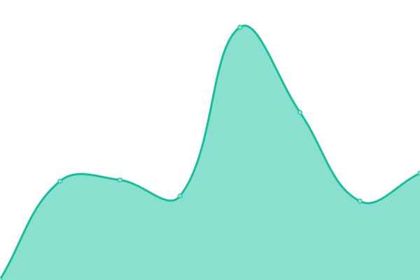
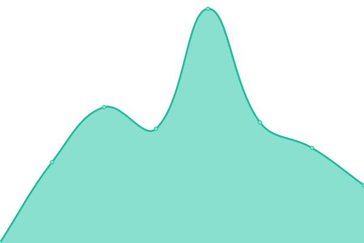
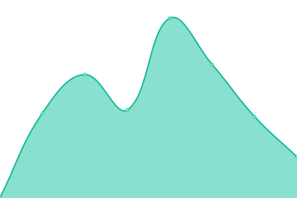

# [📈 Live Status](https://upptime.github.io/upptime): <!--live status--> **🟧 Partial outage**

This repository contains the open-source uptime monitor and status page for [Upptime](https://upptime.js.org), powered by [Upptime](https://github.com/upptime/upptime).

With [Upptime](https://upptime.js.org), you can get your own unlimited and free uptime monitor and status page, powered entirely by a GitHub repository. We use [Issues](https://github.com/upptime/upptime/issues) as incident reports, [Actions](https://github.com/BotBuildersTech/botbuilders/actions) as uptime monitors, and [Pages](https://upptime.github.io/upptime) for the status page.

<!--start: status pages-->
<!-- This summary is generated by Upptime (https://github.com/upptime/upptime) -->
<!-- Do not edit this manually, your changes will be overwritten -->
<!-- prettier-ignore -->
| URL | Status | History | Response Time | Uptime |
| --- | ------ | ------- | ------------- | ------ |
|  [Chatrace Login](https://chatrace.com/en/login.php) | 🟩 Up | [chatrace-login.yml](https://github.com/BotBuildersTech/botbuilders/commits/HEAD/history/chatrace-login.yml) | 

 529ms
     
 | 

<a href="https://BotBuildersTech.github.io/botbuilders/history/chatrace-login">100.00%</a>
    

|  [BotBuilders Login](https://app.botbuilders.tech/en/login.php) | 🟩 Up | [bot-builders-login.yml](https://github.com/BotBuildersTech/botbuilders/commits/HEAD/history/bot-builders-login.yml) | 

 592ms
     
 | 

<a href="https://BotBuildersTech.github.io/botbuilders/history/bot-builders-login">100.00%</a>
    

|  [BotBuilders.tech](https://www.BotBuilders.tech) | 🟩 Up | [bot-builders-tech.yml](https://github.com/BotBuildersTech/botbuilders/commits/HEAD/history/bot-builders-tech.yml) | 

 75ms
     
 | 

<a href="https://BotBuildersTech.github.io/botbuilders/history/bot-builders-tech">100.00%</a>
    

|  [Chatrace](https://www.chatrace.com) | 🟩 Up | [chatrace.yml](https://github.com/BotBuildersTech/botbuilders/commits/HEAD/history/chatrace.yml) | 

 583ms
     
 | 

<a href="https://BotBuildersTech.github.io/botbuilders/history/chatrace">100.00%</a>
    

|  [Test website](https://thissitedoesnotexist.koj.co) | 🟥 Down | [test-website.yml](https://github.com/BotBuildersTech/botbuilders/commits/HEAD/history/test-website.yml) | 

 0ms
     
 | 

<a href="https://BotBuildersTech.github.io/botbuilders/history/test-website">0.00%</a>
    

<!--end: status pages-->

[**Visit our status website →**](https://upptime.github.io/upptime)

## 📄 License

- Powered by: [Upptime](https://github.com/upptime/upptime)
- Code: [MIT](./LICENSE) © [Upptime](https://upptime.js.org)
- Data in the `./history` directory: [Open Database License](https://opendatacommons.org/licenses/odbl/1-0/)
